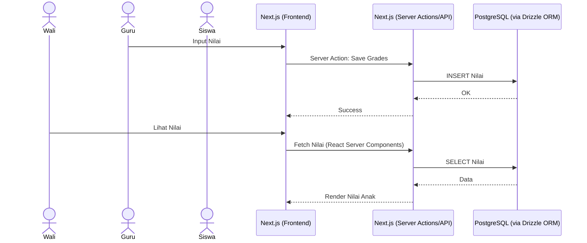
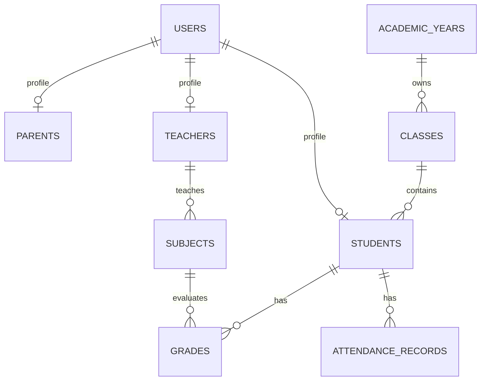

# PRD — SDI Asih Auladi School Management Platform

## 1. Overview

SDI Asih Auladi adalah platform manajemen sekolah berbasis web yang dirancang untuk mendigitalisasi operasional sekolah dasar Islam dalam satu sistem terintegrasi.

Platform ini menggabungkan:

* Website resmi sekolah
* PPDB Online
* Sistem Informasi Akademik
* Portal Guru
* Portal Siswa
* Portal Wali Murid
* Sistem Komunikasi Sekolah

---

### Masalah yang Diselesaikan

Saat ini sebagian besar proses administrasi sekolah masih dilakukan secara manual melalui:

* Grup WhatsApp
* Spreadsheet terpisah
* Dokumen cetak
* Arsip fisik

Hal ini menyebabkan:

* Data tersebar
* Sulit melakukan monitoring akademik
* Proses PPDB lambat
* Rekap absensi dan nilai memakan waktu
* Komunikasi sekolah tidak terpusat

---

### Tujuan Utama

Menyediakan satu platform digital yang memungkinkan:

* Sekolah mengelola seluruh data akademik
* Guru menginput absensi dan nilai dengan mudah
* Siswa mengakses materi pembelajaran
* Wali murid memonitor perkembangan anak
* Calon siswa melakukan PPDB secara online

---

# 2. Requirements

## Public Website

* Landing Page
* Profil Sekolah
* Visi Misi
* Berita
* Galeri
* Kontak
* PPDB Online

---

## Akademik

### Data Siswa

* CRUD siswa
* Import Excel
* Export Excel
* Riwayat akademik

### Data Guru

* CRUD guru
* Assignment mata pelajaran
* Assignment kelas

### Kelas

* Tingkat
* Wali kelas
* Kapasitas

### Mata Pelajaran

* CRUD
* Assignment guru

### Tahun Ajaran

* Multi tahun ajaran
* Multi semester
* Arsip historis

---

## Akademik Harian

### Jadwal

* Jadwal pelajaran
* Validasi bentrok jadwal

### Absensi

Status:

* Hadir
* Izin
* Sakit
* Alpha

### Penilaian

Jenis:

* Tugas
* Quiz
* UTS
* UAS
* Rapor

---

## Komunikasi

### Pengumuman

Target:

* Semua pengguna
* Guru
* Siswa
* Wali murid

### Notifikasi

* In App
* Email

---

## PPDB Online

Alur:

Pendaftaran
↓
Upload Dokumen
↓
Verifikasi
↓
Seleksi
↓
Pengumuman

Status:

* Draft
* Submitted
* Verified
* Accepted
* Rejected

---

# 3. Core Features

## Website CMS

Admin dapat mengelola:

* Halaman profil
* Visi misi
* Berita
* Galeri
* Banner

---

## Dashboard Akademik

Dashboard menampilkan:

* Jumlah siswa
* Jumlah guru
* Kehadiran harian
* Statistik PPDB

---

## Portal Guru

Guru dapat:

* Mengelola absensi
* Menginput nilai
* Upload materi
* Melihat jadwal

---

## Portal Siswa

Siswa dapat:

* Melihat nilai
* Mengakses materi
* Melihat jadwal
* Membaca pengumuman

---

## Portal Wali Murid

Wali dapat:

* Melihat nilai anak
* Melihat absensi anak
* Melihat pengumuman sekolah

---

# 4. User Flow

## A. Alur PPDB

1. Calon siswa membuka halaman PPDB.
2. Mengisi formulir pendaftaran.
3. Mengunggah dokumen persyaratan.
4. Sistem membuat nomor pendaftaran.
5. Operator melakukan verifikasi.
6. Status pendaftaran diperbarui.
7. Calon siswa melihat hasil seleksi.

---

## B. Alur Guru

1. Login ke dashboard.
2. Memilih kelas.
3. Mengisi absensi harian.
4. Menginput nilai siswa.
5. Mengunggah materi pembelajaran.

---

## C. Alur Wali Murid

1. Login portal wali.
2. Memilih anak yang terhubung.
3. Melihat:

   * Absensi
   * Nilai
   * Pengumuman
4. Menerima notifikasi jika ada informasi baru.

---

## D. Alur Operator

1. Login dashboard.
2. Mengelola data siswa.
3. Mengelola data guru.
4. Mengelola jadwal.
5. Memverifikasi PPDB.
6. Membuat pengumuman.

---

# 5. Architecture

Menggunakan arsitektur Full-Stack berbasis Next.js 15 (Server Actions & API Routes) dengan Drizzle ORM.



---

# 6. Database Schema

## Users

```text
id
name
email
password
role
```

---

## Students

```text
id
nis
nisn
name
gender
birth_date
address
```

---

## Teachers

```text
id
nip
name
phone
email
```

---

## Parents

```text
id
student_id
name
phone
relationship
```

---

## Academic Years

```text
id
name
is_active
```

---

## Classes

```text
id
academic_year_id
name
level
homeroom_teacher_id
```

---

## Subjects

```text
id
name
code
```

---

## Attendance Records

```text
id
student_id
class_id
date
status
```

---

## Grades

```text
id
student_id
subject_id
teacher_id
score
type
```

---

## PPDB Applications

```text
id
registration_number
student_name
status
submitted_at
```

---

# 7. ERD



---

# 8. Tech Stack

## Full-Stack Framework

### Next.js 15

Digunakan untuk:

* Public Website
* Portal Guru
* Portal Siswa
* Portal Wali Murid
* Backend API & Server Actions

Library:

* TypeScript
* Tailwind CSS v4
* Shadcn UI
* Drizzle ORM (Database Access)
* NextAuth.js / Auth.js (Authentication & RBAC)
* React Hook Form
* Zod

---

## Database

### PostgreSQL 17

Alasan:

* Relasi akademik kompleks
* Full Text Search
* JSONB
* Lebih scalable dibanding MySQL

---

## Cache & Queue

### Redis

Digunakan untuk:

* Session
* Cache
* Queue
* Notification

---

## File Storage

### Cloudflare R2

Digunakan untuk:

* Dokumen PPDB
* Materi pembelajaran
* Galeri sekolah

---

## Deployment

### Docker + Coolify / Vercel

Environment:

```text
Cloudflare
↓
Next.js (Server)
↓
PostgreSQL
↓
Cloudflare R2
```

---

# 9. Security Requirements

* CSRF Protection
* XSS Protection
* Content Security Policy
* Rate Limiting
* File Validation
* Audit Logs
* Role Based Access Control
* MFA untuk Admin

---

# 10. Future Roadmap

## Phase 2

* WhatsApp Gateway
* E-Rapor
* Digital Signature

## Phase 3

* Mobile App
* CBT Online
* Pembayaran SPP

## Phase 4

* Multi School SaaS
* AI Assistant Guru
* AI Academic Analytics

---