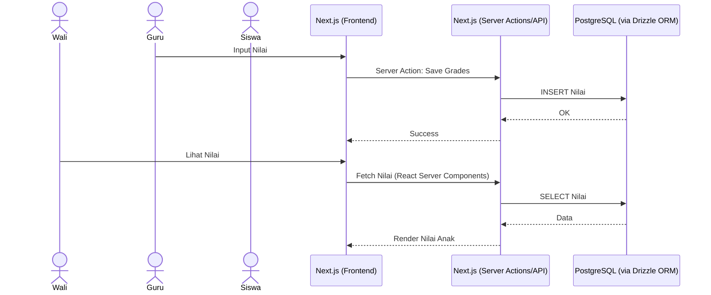
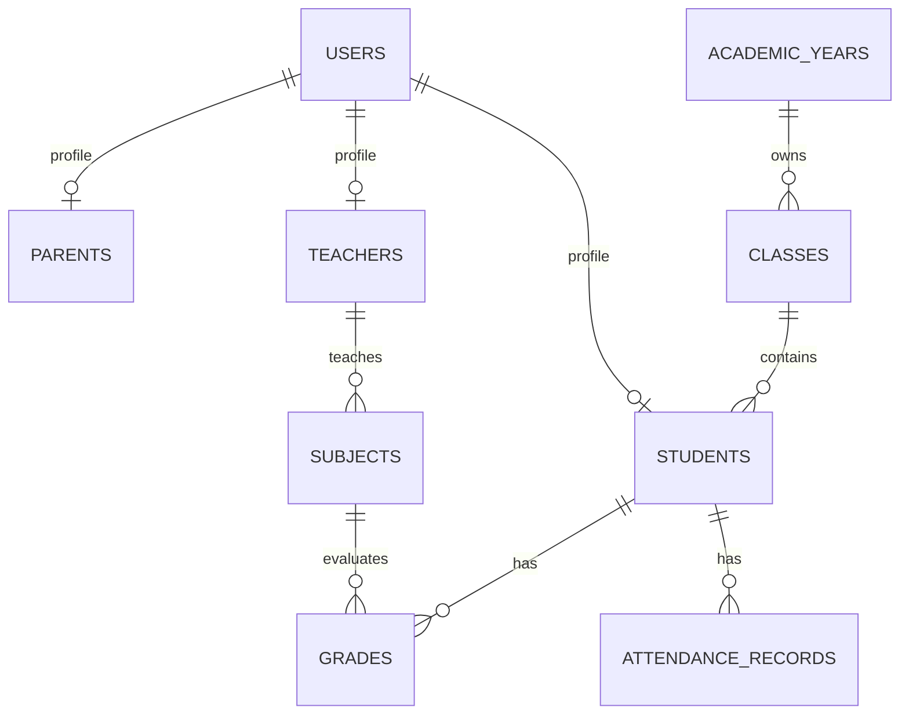

# PRD — SDI Asih Auladi School Management Platform

## 1. Overview

SDI Asih Auladi adalah platform manajemen sekolah berbasis web yang dirancang untuk mendigitalisasi operasional sekolah dasar Islam dalam satu sistem terintegrasi.

Platform ini menggabungkan:

* Website resmi sekolah
* PPDB Online
* Sistem Informasi Akademik
* Portal Guru
* Portal Siswa
* Portal Wali Murid
* Sistem Komunikasi Sekolah

---

### Masalah yang Diselesaikan

Saat ini sebagian besar proses administrasi sekolah masih dilakukan secara manual melalui:

* Grup WhatsApp
* Spreadsheet terpisah
* Dokumen cetak
* Arsip fisik

Hal ini menyebabkan:

* Data tersebar
* Sulit melakukan monitoring akademik
* Proses PPDB lambat
* Rekap absensi dan nilai memakan waktu
* Komunikasi sekolah tidak terpusat

---

### Tujuan Utama

Menyediakan satu platform digital yang memungkinkan:

* Sekolah mengelola seluruh data akademik
* Guru menginput absensi dan nilai dengan mudah
* Siswa mengakses materi pembelajaran
* Wali murid memonitor perkembangan anak
* Calon siswa melakukan PPDB secara online

---

# 2. Requirements

## Public Website

* Landing Page
* Profil Sekolah
* Visi Misi
* Berita
* Galeri
* Kontak
* PPDB Online

---

## Akademik

### Data Siswa

* CRUD siswa
* Import Excel
* Export Excel
* Riwayat akademik

### Data Guru

* CRUD guru
* Assignment mata pelajaran
* Assignment kelas

### Kelas

* Tingkat
* Wali kelas
* Kapasitas

### Mata Pelajaran

* CRUD
* Assignment guru

### Tahun Ajaran

* Multi tahun ajaran
* Multi semester
* Arsip historis

---

## Akademik Harian

### Jadwal

* Jadwal pelajaran
* Validasi bentrok jadwal

### Absensi

Status:

* Hadir
* Izin
* Sakit
* Alpha

### Penilaian

Jenis:

* Tugas
* Quiz
* UTS
* UAS
* Rapor

---

## Komunikasi

### Pengumuman

Target:

* Semua pengguna
* Guru
* Siswa
* Wali murid

### Notifikasi

* In App
* Email

---

## PPDB Online

> [!NOTE]
> **Status:** Fitur PPDB Online disembunyikan/ditunda untuk sementara waktu atas permintaan pihak sekolah. Fitur tetap ada di dalam kode (tidak dihapus) namun disembunyikan dari UI (Navbar, Footer, dsb).

Alur:

Pendaftaran
↓
Upload Dokumen
↓
Verifikasi
↓
Seleksi
↓
Pengumuman

Status:

* Draft
* Submitted
* Verified
* Accepted
* Rejected

---

# 3. Core Features

## Website CMS

Admin dapat mengelola:

* Halaman profil
* Visi misi
* Berita
* Galeri
* Banner

---

## Dashboard Akademik

Dashboard menampilkan:

* Jumlah siswa
* Jumlah guru
* Kehadiran harian
* Statistik PPDB

---

## Portal Guru

Guru dapat:

* Mengelola absensi harian kelas
* Mengirimkan notifikasi absensi _real-time_ otomatis ke Wali Murid
* Menginput Nilai Akademik & Rapor Kurikulum Merdeka (Penilaian Sikap/Karakter, Target Hafalan Tahfidz)
* Mengunggah materi pembelajaran dan tugas
* Mengakses **Buku Penghubung Digital** untuk mengirimkan catatan khusus/teguran/apresiasi kepada Wali Murid secara personal
* Melihat jadwal mengajar

---

## Portal Siswa

Siswa dapat:

* Melihat nilai dan rapor capaian akademik
* Mengakses materi dan mengumpulkan tugas
* Melihat jadwal pelajaran
* Membaca pengumuman sekolah

---

## Portal Admin (Operator Utama)

Admin dapat:

* **Manajemen Pengguna (Wajib):** Membuat, mengedit, dan mengelola akun untuk Guru, Siswa, dan Wali Murid secara terpusat (tidak ada pendaftaran mandiri selain PPDB)
* Mengelola data master siswa
* Mengelola data master guru
* Mengelola jadwal pelajaran
* Melakukan verifikasi pembayaran PPDB & mengelola SPP bulanan
* Menerbitkan pengumuman sekolah dan artikel berita
* Mengatur *settings* website (nama, kontak, logo sekolah)

---

## Portal Wali Murid

Wali dapat:

* Melihat nilai rapor anak (Akademik, Sikap, dan Tahfidz)
* Melihat rekap absensi anak & menerima notifikasi kehadiran harian secara _real-time_
* Memantau **Buku Penghubung Digital**, membalas pesan dari guru, dan mengajukan izin sakit/absen harian
* **Manajemen Keuangan:** Melihat tagihan SPP bulanan, riwayat pembayaran, dan mengunggah bukti bayar secara mandiri
* Melihat pengumuman sekolah terpusat

---

# 4. User Flow

## A. Alur PPDB *(Fitur Disembunyikan Sementara)*

1. Calon siswa (orang tua) membuka halaman PPDB.
2. Mengisi formulir pendaftaran awal (Nama, Kontak, Asal Sekolah).
3. Sistem membuat **Nomor Tagihan/Virtual Account** untuk biaya pendaftaran.
4. Orang tua melakukan pembayaran dan mengunggah **Bukti Bayar**.
5. Operator/Bendahara melakukan **Verifikasi Pembayaran**.
6. Setelah lunas, orang tua melengkapi biodata lengkap dan mengunggah dokumen persyaratan (KK, Akta).
7. Operator memverifikasi kelengkapan berkas akademik.
8. Status pendaftaran diperbarui dan hasil seleksi diumumkan ke Dasbor Calon Siswa.

---

## B. Alur Guru

1. Login ke dashboard.
2. Memilih kelas.
3. Mengisi **absensi harian** (sistem otomatis men- _trigger_ notifikasi _real-time_ ke HP Wali Murid yang anaknya alpa/terlambat).
4. Menginput **nilai akademik** dan **nilai sikap/tahfidz** (Kurikulum Merdeka).
5. Mengelola **Buku Penghubung Digital** (menulis catatan personal untuk anak tertentu, membaca permohonan izin dari wali).
6. Mengunggah materi pembelajaran dan penugasan.

---

## C. Alur Wali Murid

1. Login portal wali.
2. Memilih profil anak yang terhubung.
3. Mengecek **Riwayat Tagihan SPP**:
   * Melihat tagihan aktif bulan berjalan.
   * Mengunggah bukti bayar cicilan/SPP.
   * Mengecek riwayat konfirmasi lunas dari Bendahara.
4. Melihat pembaruan *real-time*:
   * Notifikasi Kehadiran & Absensi harian.
   * Pesan langsung dari guru di **Buku Penghubung** dan membalasnya.
   * Nilai terbaru & capaian karakter/hafalan anak.
   * Pengumuman terpusat sekolah.

---

## D. Alur Operator / Admin

1. Login dashboard.
2. **Pembuatan & Manajemen Akun (Wajib):** Mendaftarkan (membuatkan) *username* dan *password* unik untuk setiap Guru, Siswa, dan Wali Murid secara manual atau impor dari _database_ penerimaan siswa baru, kemudian membagikannya ke masing-masing pihak.
3. **Manajemen Akademik:** Mengelola data master siswa, guru, kelas, dan jadwal pelajaran.
4. **Manajemen PPDB:** Mengontrol alur seleksi pendaftaran, dan memverifikasi kelengkapan berkas pendaftar baru.
5. **Manajemen Keuangan:** Menerbitkan *invoice* SPP bulanan untuk seluruh siswa, memverifikasi unggahan bukti bayar SPP/PPDB, dan mengecek laporan pemasukan.
6. Mempublikasikan berita & pengumuman di _website_ sekolah.

---

# 5. Architecture

Menggunakan arsitektur Full-Stack berbasis Next.js 15 (Server Actions & API Routes) dengan Drizzle ORM.



---

# 6. Database Schema

## Users

```text
id
name
email
password
role
```

---

## Students

```text
id
nis
nisn
name
gender
birth_date
address
```

---

## Teachers

```text
id
nip
name
phone
email
```

---

## Parents

```text
id
student_id
name
phone
relationship
```

---

## Academic Years

```text
id
name
is_active
```

---

## Classes

```text
id
academic_year_id
name
level
homeroom_teacher_id
```

---

## Subjects

```text
id
name
code
```

---

## Attendance Records

```text
id
student_id
class_id
date
status
```

---

## Grades

```text
id
student_id
subject_id
teacher_id
score
type
```

---

## PPDB Applications

```text
id
registration_number
student_name
status
submitted_at
```

---

# 7. ERD



---

# 8. Tech Stack

## Full-Stack Framework

### Next.js 15

Digunakan untuk:

* Public Website
* Portal Guru
* Portal Siswa
* Portal Wali Murid
* Backend API & Server Actions

Library:

* TypeScript
* Tailwind CSS v4
* Shadcn UI
* Drizzle ORM (Database Access)
* Custom Session Auth with Cookies (Authentication & RBAC)
* React Hook Form
* Zod

---

## Database

### PostgreSQL 17

Alasan:

* Relasi akademik kompleks
* Full Text Search
* JSONB
* Lebih scalable dibanding MySQL

---

## Cache & Queue

### PostgreSQL

Digunakan untuk:

* Session (Via Cookies)
* Queue (Database Table)
* Notification (Database Table)

---

## File Storage

### Local Storage (public/uploads)

Digunakan untuk:

* Dokumen PPDB
* Materi pembelajaran
* Galeri sekolah

---

## Deployment

### Docker + Coolify / Vercel

Environment:

```text
Cloudflare
↓
Next.js (Server) + Local Storage
↓
PostgreSQL
```

---

# 9. Security Requirements

* CSRF Protection
* XSS Protection
* Content Security Policy
* Rate Limiting
* File Validation
* Audit Logs
* Role Based Access Control
* MFA untuk Admin

---

# 10. Future Roadmap

## Phase 2

* WhatsApp Gateway
* E-Rapor
* Digital Signature

## Phase 3

* Mobile App
* CBT Online
* Pembayaran SPP

## Phase 4

* Multi School SaaS
* AI Assistant Guru
* AI Academic Analytics

---

# 11. Panduan Desain UI/UX

> Panduan ini dirancang agar cukup presisi untuk dieksekusi oleh developer atau AI agent, menghasilkan desain yang terasa **handcrafted**, **warm**, dan **professional** — bukan template generik.

---

## 11.1 Design Philosophy & Principles

### Identitas Visual

SDI Asih Auladi adalah sekolah dasar Islam di Depok. Identitas visual harus mencerminkan:

* **Kepercayaan (Trust)** — Orang tua mempercayakan anak mereka. Desain harus terasa solid, rapi, dan profesional.
* **Kehangatan (Warmth)** — Ini sekolah untuk anak-anak. Desain tidak boleh dingin atau korporat. Gunakan warna hangat, sudut membulat, dan whitespace yang generous.
* **Modernitas Islami** — Bukan tradisional-kuno, tapi juga bukan terlalu sekular. Subtle Islamic elements (geometric patterns, calligraphy-inspired curves) bisa digunakan sebagai dekorasi, bukan fokus utama.
* **Kejelasan (Clarity)** — User utama adalah guru dan orang tua yang mungkin tidak tech-savvy. Setiap elemen harus jelas fungsinya.

### Prinsip Desain

1. **Clarity over Cleverness** — Jangan gunakan layout atau interaksi yang membingungkan demi estetika. Lebih baik boring tapi jelas.
2. **Warmth over Coldness** — Pilih warna warm-neutral (stone/warm-gray) daripada cold-neutral (slate/cool-gray). Rounded corners everywhere.
3. **Intentional Whitespace** — Beri ruang bernafas antar section. Jangan padatkan konten.
4. **Consistent Rhythm** — Gunakan spacing system yang konsisten. Jangan ad-hoc.
5. **Progressive Disclosure** — Tampilkan informasi penting dulu, detail bisa diakses via klik/expand.
6. **Content-First** — Desain melayani konten, bukan sebaliknya. Hindari dekorasi berlebihan yang mengalihkan dari informasi.

### Anti-Pattern (Hal yang HARUS Dihindari)

* ❌ Blob animation di hero section (terlalu generik, signature AI template)
* ❌ Gradient text pada heading (sulit dibaca, terasa gimmicky)
* ❌ Terlalu banyak warna berbeda dalam satu halaman
* ❌ Card tanpa konten nyata (placeholder icon besar sebagai pengganti foto)
* ❌ Shadow terlalu tebal atau multiple shadow layers
* ❌ Animasi yang tidak punya tujuan fungsional
* ❌ Font size terlalu kecil (< 14px untuk body text)
* ❌ Menggunakan GraduationCap icon sebagai pengganti logo sekolah yang asli
* ❌ Pure white (#fff) background tanpa warmth

---

## 11.2 Color System

### Referensi Brand

Warna logo SDI Asih Auladi adalah **Teal** (buku terbuka + kubah masjid + teks). Palette berikut dibangun berbasis warna tersebut tapi dengan variasi yang lebih kaya.

### Primary Palette — Teal (dari Logo)

Warna utama untuk branding, CTA, navigasi aktif, dan aksen penting.

```
teal-50:  #f0fdfa   — Background highlight sangat ringan
teal-100: #ccfbf1   — Background badge, tag
teal-200: #99f6e4   — Border light
teal-300: #5eead4   — Border medium
teal-400: #2dd4bf   — Icon secondary
teal-500: #14b8a6   — Button secondary, link hover
teal-600: #0d9488   — Button primary, icon primary  ← WARNA LOGO
teal-700: #0f766e   — Button primary hover, heading accent
teal-800: #115e59   — Text emphasis
teal-900: #134e4a   — Text dark emphasis
teal-950: #042f2e   — Background dark
```

### Secondary Palette — Amber (Warmth & Energy)

Aksen kedua untuk highlight, badges penting, rating, dan elemen yang perlu perhatian.

```
amber-50:  #fffbeb
amber-100: #fef3c7
amber-200: #fde68a
amber-300: #fcd34d
amber-400: #fbbf24   — Star/rating, highlight
amber-500: #f59e0b   — Badge penting
amber-600: #d97706
```

### Neutral Palette — Stone (Warm Gray)

Gunakan `stone` bukan `slate` untuk nuansa yang lebih hangat.

```
stone-50:  #fafaf9   — Page background (bukan pure white)
stone-100: #f5f5f4   — Card background alt, section background
stone-200: #e7e5e4   — Border default, divider
stone-300: #d6d3d1   — Border emphasis
stone-400: #a8a29e   — Placeholder text
stone-500: #78716c   — Body text secondary
stone-600: #57534e   — Body text primary
stone-700: #44403c   — Heading secondary
stone-800: #292524   — Heading primary
stone-900: #1c1917   — Text darkest
stone-950: #0c0a09   — Near-black
```

### Semantic Colors

```
Success:  teal-600 (#0d9488)   — Operasi berhasil, status aktif
Warning:  amber-500 (#f59e0b)  — Perlu perhatian, pending
Error:    rose-500 (#f43f5e)   — Error, destructive action
Info:     sky-500 (#0ea5e9)    — Informational, tips
```

### Portal Accent Colors

Setiap portal memiliki warna aksen tersendiri untuk identitas visual di dashboard:

```
Admin:  teal-600 (#0d9488)    — Warna brand utama
Guru:   sky-600 (#0284c7)     — Profesional, tenang
Siswa:  violet-500 (#8b5cf6)  — Muda, energik
Wali:   emerald-600 (#059669) — Nurturing, growth
```

### Background Surfaces

```
Page background:     stone-50 (#fafaf9)
Card background:     white (#ffffff)
Card background alt: stone-100 (#f5f5f4)
Sidebar background:  white (#ffffff)
Modal backdrop:      stone-950/60 (60% opacity)
Code/pre background: stone-100 (#f5f5f4)
```

---

## 11.3 Typography System

### Font Pairing

```
Heading Font: "Plus Jakarta Sans" (Google Fonts)
  — Geometric sans-serif, modern tapi friendly
  — Weight: 600 (semibold) untuk h3-h6, 700 (bold) untuk h1-h2

Body Font: "Inter" (Google Fonts) — sudah dipakai
  — Highly legible, netral
  — Weight: 400 (regular) untuk body, 500 (medium) untuk label/emphasis
```

### Type Scale

```
Display:    48px / 52px line-height / -0.02em tracking / Plus Jakarta Sans 700
H1:         36px / 40px line-height / -0.02em tracking / Plus Jakarta Sans 700
H2:         30px / 36px line-height / -0.01em tracking / Plus Jakarta Sans 700
H3:         24px / 32px line-height / -0.01em tracking / Plus Jakarta Sans 600
H4:         20px / 28px line-height / normal tracking  / Plus Jakarta Sans 600
H5:         18px / 26px line-height / normal tracking  / Plus Jakarta Sans 600
H6:         16px / 24px line-height / normal tracking  / Plus Jakarta Sans 600

Body Large: 18px / 28px line-height / Inter 400
Body:       16px / 26px line-height / Inter 400      ← Default body
Body Small: 14px / 22px line-height / Inter 400
Caption:    13px / 18px line-height / Inter 400
Overline:   12px / 16px line-height / Inter 500 / UPPERCASE / 0.05em tracking
```

### Responsive Type Scale

```
Mobile (< 768px):
  Display → 32px
  H1 → 28px
  H2 → 24px
  Body Large → 16px

Desktop (≥ 1024px):
  Menggunakan scale penuh di atas
```

### Heading Color Rules

```
Page title (H1):      stone-900
Section title (H2):   stone-800
Subsection title (H3-H4): stone-700
Body text:            stone-600
Secondary text:       stone-500
Disabled/placeholder: stone-400
```

---

## 11.4 Spacing & Layout System

### Base Unit

Semua spacing menggunakan kelipatan 4px:

```
4px  (1)   — Micro gap (antar icon dan label inline)
8px  (2)   — Tight gap (antar badge items, compact list)
12px (3)   — Default gap (antar form fields label-input)
16px (4)   — Standard gap (antar items dalam card, list items)
20px (5)   — Medium gap
24px (6)   — Section inner padding, card padding
32px (8)   — Between cards/components
40px (10)  — Between sections (mobile)
48px (12)  — Section padding vertical (mobile)
64px (16)  — Between major sections (mobile)
80px (20)  — Section padding vertical (desktop)
96px (24)  — Between major sections (desktop)
```

### Container

```
Max width:    1280px (max-w-7xl)
Side padding: 16px mobile, 24px tablet, 32px desktop
```

### Card Padding

```
Compact card: 16px
Default card: 24px
Spacious card: 32px
```

### Border Radius

```
Button:       12px (rounded-xl)
Card:         16px (rounded-2xl)
Badge/Tag:    8px (rounded-lg) atau full (rounded-full untuk pill)
Input:        12px (rounded-xl)
Modal:        20px (rounded-[20px])
Avatar:       rounded-full
Image:        16px (rounded-2xl) atau 24px (rounded-3xl)
```

### Responsive Breakpoints

```
sm:  640px   — Phone landscape
md:  768px   — Tablet portrait
lg:  1024px  — Tablet landscape / Small laptop
xl:  1280px  — Desktop
2xl: 1536px  — Large desktop
```

---

## 11.5 Component Style Guide

### Buttons

```
Primary:
  Background: teal-600 → hover: teal-700
  Text: white
  Height: 44px (h-11)
  Padding: 0 24px
  Border-radius: 12px
  Font: Inter 500, 14px
  Transition: background 200ms ease, transform 100ms ease
  Active: scale(0.98)

Secondary:
  Background: stone-100 → hover: stone-200
  Text: stone-700
  Border: 1px solid stone-200
  Sama height & radius dengan primary

Ghost:
  Background: transparent → hover: stone-100
  Text: stone-600 → hover: stone-900

Destructive:
  Background: rose-500 → hover: rose-600
  Text: white

Icon Button:
  Size: 40px × 40px
  Border-radius: 12px
  Background: transparent → hover: stone-100
```

### Cards

```
Default:
  Background: white
  Border: 1px solid stone-200
  Border-radius: 16px
  Shadow: 0 1px 3px rgba(0,0,0,0.04), 0 1px 2px rgba(0,0,0,0.02)
  Padding: 24px
  Hover (jika clickable): shadow meningkat, translateY(-2px), border-color stone-300
  Transition: all 200ms ease

Elevated:
  Sama seperti default tapi shadow:
  0 4px 6px rgba(0,0,0,0.04), 0 2px 4px rgba(0,0,0,0.02)

Stat Card:
  Selalu punya icon circle di kanan atas header
  Icon circle: 40px, rounded-xl, bg-{accent}-100, icon color {accent}-600
  Value: text-3xl font-bold stone-900
  Label: text-sm font-medium stone-500 (di atas value)
  Trend indicator: teks kecil di bawah value, warna hijau untuk naik, merah untuk turun
```

### Tables

```
Container:
  Background: white
  Border: 1px solid stone-200
  Border-radius: 16px
  Overflow: hidden

Header:
  Background: stone-50
  Text: overline style (12px, uppercase, stone-500, 500 weight)
  Padding: 12px 16px
  Border-bottom: 1px solid stone-200

Row:
  Padding: 16px
  Border-bottom: 1px solid stone-100
  Hover: background stone-50
  Transition: background 150ms

Last row:
  Tanpa border-bottom

Cell text:
  Primary column: 14px, stone-800, font-medium
  Secondary columns: 14px, stone-600, font-normal

Empty state:
  Centered icon (48px, stone-300) + teks (stone-500)
  Padding: 48px vertikal
```

### Forms

```
Input/Select:
  Height: 44px
  Background: white (bukan gray)
  Border: 1px solid stone-300
  Border-radius: 12px
  Padding: 0 14px
  Font: 15px, stone-800
  Placeholder: stone-400
  Focus: border-color teal-500, ring 3px teal-500/20
  Error: border-color rose-500, ring 3px rose-500/20
  Transition: border-color 200ms, box-shadow 200ms

Textarea:
  Min-height: 120px
  Padding: 12px 14px
  Resize: vertical only

Label:
  Font: 14px, Inter 500, stone-700
  Margin-bottom: 6px

Error message:
  Font: 13px, Inter 400, rose-600
  Margin-top: 6px
  Prefix dengan icon AlertCircle (13px)

Form section:
  Group related fields with a subtle heading (H5 style)
  Divider antar section: 1px stone-200 + 24px margin

Helper text:
  Font: 13px, Inter 400, stone-500
  Margin-top: 4px
```

### Badges / Tags

```
Default:
  Padding: 4px 10px
  Border-radius: 8px (rounded-lg)
  Font: 12px, Inter 500
  Border: 1px solid

Variants:
  Success: bg-teal-50, text-teal-700, border-teal-200
  Warning: bg-amber-50, text-amber-700, border-amber-200
  Error:   bg-rose-50, text-rose-700, border-rose-200
  Info:    bg-sky-50, text-sky-700, border-sky-200
  Neutral: bg-stone-100, text-stone-600, border-stone-200

Pill variant (rounded-full):
  Padding: 4px 12px
  Untuk status badges yang inline
```

### Navigation

#### Public Navbar

```
Height: 64px
Background: white/90, backdrop-blur-lg
Border-bottom: 1px solid stone-200/60
Position: sticky top-0 z-50
Shadow: 0 1px 3px rgba(0,0,0,0.03)

Logo: logo-asih-auladi.png (32px height) + teks "SDI Asih Auladi" (font Plus Jakarta Sans 700, teal-800)
  — JANGAN gunakan icon GraduationCap, gunakan logo asli

Nav links:
  Font: 14px, Inter 500
  Color: stone-600 → hover: teal-600
  Transition: color 200ms
  Active: teal-700, font-semibold

CTA Button (Login):
  Style: ghost button → teal-700

Mobile hamburger:
  Icon: 24px
  Sheet dari kanan, width 300px
```

#### Dashboard Sidebar

```
Width: 260px (desktop), hidden (mobile, replaced by top bar + hamburger)
Background: white
Border-right: 1px solid stone-200

Logo area:
  Height: 64px
  Padding: 0 20px
  Background: teal-50/50
  Logo + text

Menu items:
  Padding: 10px 14px
  Border-radius: 12px
  Gap icon-text: 12px
  Icon: 20px
  Font: 14px, Inter 500
  Color: stone-600, icon stone-400
  Hover: background stone-100, text stone-900, icon stone-600
  Active: background teal-50, text teal-700, icon teal-600, font-semibold
  Transition: all 200ms

Section divider:
  Overline label (12px, uppercase, stone-400) + 16px margin-top

User area (bottom):
  Border-top: 1px stone-200
  Avatar (40px, rounded-full) + name + role
  Logout button: text rose-600, hover bg-rose-50
```

### Modals / Dialogs

```
Backdrop: stone-950/50, backdrop-blur-sm
Container: white, rounded-[20px], shadow-2xl
Max-width: 480px (small), 640px (medium), 800px (large)
Padding: 24px

Header:
  Title: H4 style
  Close button: top-right, icon button 36px
  Border-bottom: 1px stone-200

Footer:
  Border-top: 1px stone-200
  Padding-top: 16px
  Buttons aligned right

Animation:
  Entry: fade-in + scale from 0.95 → 1.0, 200ms ease-out
  Exit: fade-out + scale to 0.95, 150ms ease-in
```

### Toast / Notification

```
Position: bottom-right
Width: 360px
Background: white
Border: 1px solid stone-200
Border-radius: 16px
Shadow: lg
Padding: 16px

Left accent border:
  4px wide, rounded
  Success: teal-500
  Error: rose-500
  Warning: amber-500
  Info: sky-500

Auto-dismiss: 5 detik
Animation: slide-in dari kanan + fade
```

---

## 11.6 Page-by-Page UI Specifications

### Public Website

#### Landing Page (`/`)

**Hero Section:**
* Layout: Split (bukan centered). Kiri: teks + CTA. Kanan: foto/ilustrasi sekolah (jika belum ada foto, gunakan geometric Islamic pattern sebagai background + logo besar).
* Background: stone-50 dengan subtle geometric pattern di kanan (opacity rendah).
* Heading: Display size, stone-900. Kata kunci di-highlight dengan warna teal-600 (bukan gradient, bukan italic — cukup warna saja).
* Subheading: Body Large, stone-600, max-width 500px.
* CTA: Satu tombol primary "Masuk Portal" yang langsung ke /login. Satu tombol secondary "Tentang Kami" ke /profil.
* Tidak ada badge "PPDB Dibuka" saat fitur PPDB disembunyikan.
* Tidak ada blob animation.

**Statistik Section:**
* 3-4 stat items dalam satu baris (grid)
* Setiap stat: angka besar (Display size, teal-700) + label (Caption, stone-500)
* Container: Card elevated, rounded-3xl
* Angka: 450+ Siswa, 45 Guru & Staf, 18 Kelas, 14+ Tahun
* Posisi: overlap sedikit dengan hero section via negative margin

**Visi Misi Section:**
* Layout: 2 kolom. Kiri: gambar/placeholder (gunakan Islamic geometric pattern jika belum ada foto). Kanan: konten teks.
* Visi dan Misi masing-masing dalam card dengan icon check, background stone-100
* Heading: H2, "Membentuk Generasi Qur'ani"

**Fitur Platform Section:**
* Heading center: H2, "Satu Platform, Beragam Kemudahan"
* 3 cards grid: Portal Guru (icon sky-500), Portal Siswa (icon violet-500), Portal Wali Murid (icon emerald-500)
* Card style: bg white, hover: translateY(-4px) + shadow meningkat
* Setiap card punya icon circle (48px) di atas, title, description

**Berita Section:**
* Heading left-aligned + "Lihat Semua" link di kanan
* 3 cards horizontal. Setiap card: gambar atas (aspect 16:9), konten bawah
* Jika belum ada gambar berita: tampilkan background teal-50 + icon BookOpen (bukan kosong)
* Card: hover efek pada judul (warna → teal-600) + image zoom subtle

**Galeri Section:**
* Grid 4 kolom (2 di mobile)
* Aspect ratio: square
* Hover: overlay gradient + judul foto
* Rounded corners: 16px

#### Profil Sekolah (`/profil`)

* Page header: Badge "Sejarah & Profil" + H1 center + subtitle
* 2-kolom: gambar kiri (dengan overlay teal tint jika mau), teks kanan
* Stats: 14+ Tahun, 1200+ Alumni
* Facilities section: grid 3 kolom, setiap facility card punya icon + nama

#### Visi Misi (`/visi-misi`)

* Clean centered layout
* Visi dalam 1 card besar
* Misi dalam numbered list, setiap item punya icon checkmark

#### Berita List (`/berita`)

* Grid 3 kolom (1 mobile, 2 tablet)
* Filter/search bar di atas (opsional)
* Pagination di bawah (numbered, bukan infinite scroll)
* Card style sama seperti di landing page

#### Berita Detail (`/berita/[slug]`)

* Max-width 720px (reading width)
* H1 + meta (tanggal, author) + featured image + prose content
* Sidebar (opsional): berita terkait
* Typography: prose styling (paragraf spacing 1.5em, heading spacing 2em)

#### Galeri (`/galeri`)

* Grid 4 kolom (2 mobile)
* Lightbox on click (modal dengan navigasi prev/next)
* Upload date visible on hover

#### Kontak (`/kontak`)

* 2 kolom: form kiri, info kontak kanan
* Form: nama, email, subjek, pesan, tombol kirim
* Info: alamat, telepon, email, jam operasional
* Embedded Google Maps (jika ada) atau placeholder

#### Login (`/login`)

* Layout: BUKAN centered card di gray background (terlalu generic)
* Gunakan split-screen: kiri = branding area (teal-700 background, logo besar, tagline), kanan = form area (white background)
* Form: email, password, tombol masuk, link lupa password
* Credential demo: tetap ditampilkan tapi dalam collapsible/accordion, bukan selalu visible
* Mobile: form full-width, branding area di atas (compact)

---

### Dashboard — Layout Umum

```
Desktop:
┌──────────┬─────────────────────────────────┐
│ Sidebar  │  Top Bar (breadcrumb + user)    │
│ 260px    │─────────────────────────────────│
│          │                                 │
│  Menu    │  Page Content                   │
│  items   │  (max-width: 100%)              │
│          │  padding: 24px                  │
│          │                                 │
│ User     │                                 │
│ Logout   │                                 │
└──────────┴─────────────────────────────────┘

Mobile:
┌─────────────────────────────────┐
│ Top Bar (hamburger + logo)      │
│─────────────────────────────────│
│                                 │
│  Page Content                   │
│  padding: 16px                  │
│                                 │
└─────────────────────────────────┘
(Sidebar menjadi drawer dari kiri via hamburger)
```

Top bar:
* Height: 64px
* Background: white
* Border-bottom: 1px stone-200
* Kiri: Breadcrumb (Home > Halaman Saat Ini)
* Kanan: Notification bell icon + User avatar dropdown

Page content area:
* Background: stone-50
* Padding: 24px (desktop), 16px (mobile)

---

### Dashboard — Admin (`/dashboard/admin`)

**Header:**
* H2: "Ikhtisar Akademik"
* Subtitle: "Pantau statistik dan aktivitas sekolah hari ini."

**Stats Grid (3 kolom, bukan 4 — karena PPDB disembunyikan):**
* Total Siswa — icon Users, bg sky-100, icon sky-600
* Total Guru — icon GraduationCap, bg amber-100, icon amber-600
* Tingkat Kehadiran — icon ClipboardCheck, bg teal-100, icon teal-600

**Chart Area:**
* Tren Kehadiran Siswa — area chart / bar chart
* Gunakan library chart (recharts / chart.js) saat diimplementasikan
* Placeholder saat ini: card dengan dashed border + icon chart + teks "Grafik tren kehadiran"

**Quick Links Grid (opsional):**
* 4-6 quick action cards menuju halaman admin yang sering diakses
* Setiap card: icon + label, hover: background teal-50

---

### Dashboard — Guru (`/dashboard/guru`)

**Header:**
* "Selamat Datang, [Nama Guru]"
* Tanggal hari ini dalam badge (teal-50, teal-700)

**Quick Actions (3 cards horizontal):**
* Input Absensi → ClipboardList icon, sky accent
* Input Nilai → FileText icon, violet accent
* Upload Materi → BookOpen icon, amber accent
* Setiap card: hover → border accent color + shadow meningkat

**Jadwal Hari Ini:**
* List vertikal dengan timeline indicator (garis vertikal di kiri)
* Setiap item: waktu, mata pelajaran, kelas, status badge
* Status: "Sedang Berlangsung" (teal badge + pulse dot), "Selesai" (stone badge), "Belum Dimulai" (amber badge)

**Pengumuman Terbaru:**
* Card dengan 2-3 item terakhir
* Setiap item: icon type + title + tanggal
* Link "Lihat Semua"

---

### Dashboard — Siswa (`/dashboard/siswa`)

**Welcome Card:**
* Lebar full, background gradient ringan (teal-50 → stone-50)
* Kiri: "Selamat Belajar, [Nama]!" + tanggal + kelas
* Kanan: avatar + quick stats (rata-rata nilai, % kehadiran)

**Jadwal Hari Ini:**
* Timeline vertikal, mirip guru tapi dari perspektif siswa
* Highlight jam sekarang

**Ringkasan Nilai:**
* 4 cards: Tugas, Quiz, UTS, UAS
* Masing-masing menampilkan rata-rata terbaru
* Color coding: ≥80 teal, 60-79 amber, <60 rose

**Materi Terbaru:**
* List 3-5 materi terakhir
* Setiap item: icon mata pelajaran + judul + tanggal upload + download link

---

### Dashboard — Wali Murid (`/dashboard/wali`)

**Child Selector (jika wali punya >1 anak):**
* Horizontal pill selector di atas halaman
* Setiap pill: foto mini anak + nama
* Active pill: background teal-100, border teal-300

**Ringkasan Anak:**
* Card lebar: foto anak (avatar), nama lengkap, kelas, NIS
* 3 mini-stats di bawah: rata-rata nilai, % kehadiran, ranking (jika ada)

**Kehadiran Bulan Ini:**
* Calendar grid mini (7 kolom × 4-5 baris)
* Color coding per hari: teal (hadir), amber (izin/sakit), rose (alpha), stone-200 (weekend)
* Legend di bawah calendar

**Nilai Terbaru:**
* Tabel atau card list per mata pelajaran
* Kolom: mata pelajaran, tugas, quiz, UTS, UAS, rata-rata
* Rata-rata di-highlight dengan color coding

**Pengumuman:**
* Feed-style list
* Setiap item: tanggal + judul + snippet
* Badge "Baru" (teal) untuk pengumuman < 3 hari

---

### Dashboard — Halaman CRUD Admin (Data Siswa, Guru, Kelas, dll)

Semua halaman CRUD mengikuti pattern yang konsisten:

```
┌─────────────────────────────────────────────┐
│ H2: Judul Halaman                           │
│ Subtitle: Deskripsi singkat                 │
│                                             │
│ ┌─────────┬──────────┬────────────────────┐ │
│ │ Search  │ Filter   │        + Tambah    │ │
│ └─────────┴──────────┴────────────────────┘ │
│                                             │
│ ┌─────────────────────────────────────────┐ │
│ │ Table Header                            │ │
│ ├─────────────────────────────────────────┤ │
│ │ Row 1                        [⋯] menu  │ │
│ │ Row 2                        [⋯] menu  │ │
│ │ Row 3                        [⋯] menu  │ │
│ └─────────────────────────────────────────┘ │
│                                             │
│ ← 1 2 3 ... 10 →                           │
└─────────────────────────────────────────────┘
```

* Search: Input dengan icon Search di kiri, debounced 300ms
* Filter: Dropdown(s) sesuai konteks (kelas, status, dll)
* Tambah: Primary button, kanan atas
* Table: Mengikuti table style guide di atas
* Row action menu: Dropdown 3-dot menu dengan Edit, Hapus (destructive)
* Hapus: Konfirmasi via dialog modal
* Tambah/Edit: Modal form atau halaman terpisah (modal untuk form sederhana, halaman baru untuk form kompleks)

---

## 11.7 Animation & Interaction Guidelines

### Page Transitions

* Tidak perlu animasi transisi antar halaman (Next.js router sudah cukup cepat)
* Skeleton loading saat fetch data: gunakan pola card/table skeleton (bukan spinner)
* Skeleton: bg stone-200 dengan shimmer animation (gradient slide)

### Skeleton Loading

```
Pattern:
  3-4 rounded rectangles stacked
  Shimmer: linear-gradient yang bergerak ke kanan
  Duration: 1.5s, infinite
  Color: stone-200 → stone-100 → stone-200

Gunakan skeleton untuk:
  - Dashboard stats saat loading
  - Table rows saat loading
  - Card content saat loading
  - Form data saat loading

JANGAN gunakan spinner (LoadingSpinner) sebagai satu-satunya indikator.
```

### Micro-Interactions

```
Button press:     scale(0.97), 100ms, ease-out
Card hover:       translateY(-2px) + shadow naik, 200ms ease
Link hover:       color transition, 200ms
Nav item active:  background slide-in, 200ms
Badge appear:     scale from 0.8 → 1.0 + fade-in, 200ms
Toast appear:     slide-in dari kanan + fade-in, 300ms ease-out
Toast dismiss:    slide-out ke kanan + fade-out, 200ms ease-in
Modal open:       fade-in backdrop + scale content 0.95→1.0, 200ms
Modal close:      fade-out + scale 1.0→0.95, 150ms
Sidebar active:   background-color transition, 200ms
```

### Scroll Animations (SANGAT SUBTLE)

* Section content fade-in saat masuk viewport — HANYA untuk landing page
* Delay stagger untuk grid items: 50ms per item, max 200ms total
* JANGAN gunakan scroll animation di dashboard (mengganggu productivitas)

### Loading States

```
Button loading:    Disable + spinner (Loader2 animate-spin) + teks berubah ("Menyimpan...")
Table loading:     Skeleton rows
Card loading:      Skeleton content
Form submitting:   Semua input disabled + button loading
Page loading:      Skeleton layout
```

---

## 11.8 Iconography & Imagery

### Icon Library

* Gunakan **Lucide React** (sudah dipakai)
* Size: 16px (inline), 20px (menu/list), 24px (card header), 32px (empty state), 48px (feature highlight)
* Stroke width: default (2px)
* Color: mengikuti konteks (stone-400 default, accent color saat aktif)

### Logo

* File: `logo-asih-auladi.png` (sudah ada di root project)
* **WAJIB digunakan** di Navbar dan Sidebar, menggantikan icon GraduationCap
* Navbar: height 32px
* Sidebar: height 32px
* Login branding area: height 80px
* Favicon: buat versi simplified dari logo

### Imagery Strategy (Belum Ada Foto)

Karena foto sekolah belum tersedia, gunakan strategi berikut:

1. **Islamic Geometric Patterns** sebagai decorative background:
   * SVG pattern dengan opacity rendah (5-10%)
   * Warna: teal-600 pada white background
   * Gunakan di: hero section, section dividers, empty states

2. **Curated Stock Photos** (SEMENTARA):
   * Unsplash photos dengan tema: anak-anak belajar, sekolah Islam, kegiatan pendidikan
   * SELALU gunakan overlay teal tint untuk konsistensi
   * Aspect ratio: 16:9 untuk banner, 4:3 untuk card, 1:1 untuk thumbnail

3. **Ilustrasi Sederhana** (opsional):
   * Flat illustration style untuk empty states
   * Warna: teal + amber + stone palette
   * Contoh: anak membaca buku, guru mengajar, dll

4. **Yang HARUS dihindari**:
   * ❌ Icon besar sebagai pengganti foto (terasa kosong dan malas)
   * ❌ Foto tanpa overlay (inconsistent tone)
   * ❌ Foto yang terlalu "western" (pilih yang representatif)

---

## 11.9 Responsive Design Rules

### Mobile-First Approach

Semua styling dimulai dari mobile, lalu expand ke desktop via media queries.

### Layout Changes per Breakpoint

```
< 640px (Mobile):
  - Navbar: logo + hamburger only
  - Hero: single column, centered
  - Stats: single column, stacked
  - Cards: single column
  - Dashboard sidebar: hidden, drawer via hamburger
  - Tables: horizontal scroll atau card view
  - Form: single column
  - Footer: single column, stacked sections

640px - 768px (Tablet Portrait):
  - Cards: 2 kolom
  - Stats: 2 kolom
  - Tables: horizontal scroll

768px - 1024px (Tablet Landscape):
  - Navbar: full nav links visible
  - Hero: 2 kolom
  - Cards: 2-3 kolom
  - Dashboard sidebar: visible, collapsible
  - Tables: full width

≥ 1024px (Desktop):
  - Full layout
  - Dashboard sidebar: always visible
  - Cards: 3-4 kolom
  - Tables: full width, no scroll
```

### Touch Targets

* Minimum touch target: 44px × 44px (Apple HIG recommendation)
* Buttons: min-height 44px
* Nav links: min-height 44px
* Table row actions: 44px hit area
* Form inputs: min-height 44px

### Mobile-Specific Patterns

```
Mobile table → Card view:
  Setiap row menjadi card
  Label di atas, value di bawah
  Action buttons di footer card

Mobile sidebar → Bottom sheet / Drawer:
  Slide dari kiri (bukan overlay full-screen)
  Backdrop: stone-950/40

Mobile form → Single column:
  Semua field full-width
  Label di atas field (bukan samping)
  Submit button full-width, sticky di bottom
```

---

## 11.10 Accessibility

### Color Contrast

* Text on background: minimum 4.5:1 ratio (WCAG AA)
* Large text (≥18px bold atau ≥24px regular): minimum 3:1
* Interactive elements: minimum 3:1 against background
* **Jangan rely pada warna saja** untuk menyampaikan informasi — selalu sertakan icon atau text label

### Focus Indicators

```
Default focus ring:
  Outline: 2px solid teal-500
  Outline-offset: 2px
  Border-radius: sesuai element

Destructive focus:
  Outline: 2px solid rose-500

JANGAN pernah gunakan outline: none tanpa pengganti visual
```

### Keyboard Navigation

* Semua interactive elements harus reachable via Tab
* Order harus logical (top-to-bottom, left-to-right)
* Modal focus trap (Tab tidak keluar dari modal saat terbuka)
* Escape key menutup modal/dropdown
* Enter/Space pada button dan link

### Screen Reader

* Semua image harus punya alt text deskriptif
* Decorative images: alt="" (empty alt)
* Icon-only buttons harus punya aria-label
* Form inputs harus punya label (htmlFor linked)
* Status changes harus diumumkan via aria-live
* Heading hierarchy harus sequential (h1 → h2 → h3, bukan skip)

### Motion Sensitivity

* Respect `prefers-reduced-motion` media query
* Jika user prefers reduced motion: disable semua animasi kecuali opacity transitions
* Skeleton shimmer boleh tetap berjalan (non-disruptive)

---

## 11.11 Design Tokens Summary (Quick Reference)

```
WARNA UTAMA:
  Brand:       teal-600 (#0d9488)
  Brand Dark:  teal-800 (#115e59)
  Brand Light: teal-50  (#f0fdfa)
  Accent:      amber-400 (#fbbf24)

TEXT:
  Primary:     stone-800 (#292524)
  Secondary:   stone-600 (#57534e)
  Tertiary:    stone-500 (#78716c)
  Disabled:    stone-400 (#a8a29e)
  On-brand:    white (#ffffff)

SURFACE:
  Page:        stone-50 (#fafaf9)
  Card:        white (#ffffff)
  Elevated:    white + shadow
  Sidebar:     white (#ffffff)

BORDER:
  Default:     stone-200 (#e7e5e4)
  Emphasis:    stone-300 (#d6d3d1)
  Active:      teal-500 (#14b8a6)

RADIUS:
  Small:       8px
  Medium:      12px
  Large:       16px
  XLarge:      20px
  Full:        9999px

FONT:
  Heading:     "Plus Jakarta Sans", sans-serif
  Body:        "Inter", sans-serif

SHADOW:
  Small:       0 1px 2px rgba(0,0,0,0.04)
  Default:     0 1px 3px rgba(0,0,0,0.04), 0 1px 2px rgba(0,0,0,0.02)
  Medium:      0 4px 6px rgba(0,0,0,0.04), 0 2px 4px rgba(0,0,0,0.02)
  Large:       0 10px 15px rgba(0,0,0,0.04), 0 4px 6px rgba(0,0,0,0.02)

TRANSITION:
  Fast:        150ms ease
  Default:     200ms ease
  Slow:        300ms ease-out
```

---